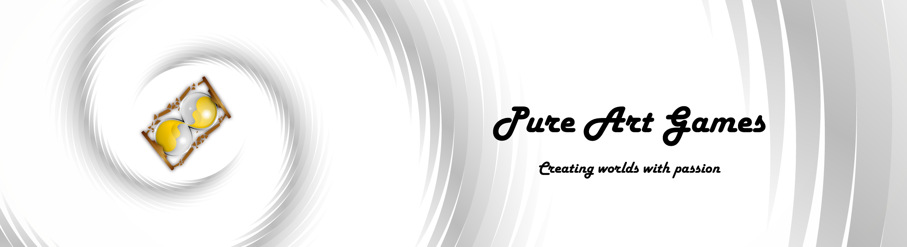

<!--- Banner with link to my youtube--->

# About Me
Hi everyone who accidentally came to my profile 👋
I'm indie game developer from Ukraine 🇺🇦 🎮 🇺🇦
I love games made with passion 🔥 and sincerely believe: games - are pure art. I make such games, that's why I call myself PureArtGames 😊

## Professional Motto
Any task is solvable, any solution is a matter of time

## Creator Motto
Create with soul for souls

***

<!---
pureartgames/pureartgames is a ✨ special ✨ repository because its `README.md` (this file) appears on your GitHub profile.
You can click the Preview link to take a look at your changes.
--->
